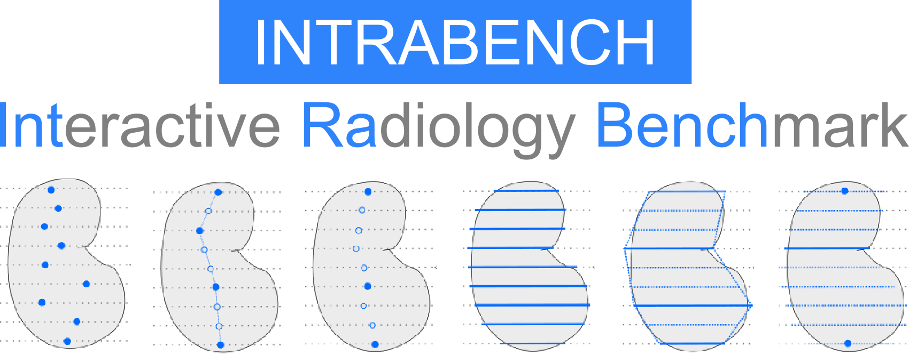

---
The **Int**eractive **Ra**diology **Bench**chmark allows open-set interactive 2D or 3D segmentation methods to evaluate themselves fairly against other methods on the field of radiological images. **IntRaBench** currently includes _6 interactive segmentation methods_, spans _eight datasets_ (including CT and MRI) with _various anatomical and pathological targets_.

Through this benchmark, we provide users with transparent results on what the best existing methods are and provide developers an extendable framework, allowing them to easily compare their newly developed models or prompting schemes against currently available methods.

## Installation
1. Activate virtualenv of choice (with e.g. python 3.12)
2. Download IntRaBench repository (clone or download and extract manually)
3. `cd intrabench && pip install -e .`
  (This will take a while to resolve dependencies -- A more constrained requirements file will be provided in the future)
4. Done.

## Usage
To use the benchmark three steps need to be conducted:
### 1. Downloading the datasets
The datasets used in the benchmark can be downloaded using the following command:

```python
python ./src/intrab/datasets_preprocessing/download_all_datasets.py
# or only download a subset of datasets
python ./src/intrab/datasets_preprocessing/download_all_datasets.py --datasets ms_flair hanseg # can be multiple
```

Regarding selective downloads one can choose from:
  `["segrap", "hanseg", "ms_flair", "hntsmrg", "hcc_tace", "adrenal_acc", "rider_lung", "colorectal", "lnq", "pengwin"]`

### 2. Preprocessing the dataset
The dataset is often provided in a raw format, e.g. DICOMs which are not directly usable and can be a pain to deal with. To simplify things we provide preprocessing schemes that convert these directly to easier useable formats. The preprocessing can be done using the following commands.

```python
python ./src/intrab/datasets_preprocessing/preprocess_datasets.py --datasets ms_flair hanseg  # can be multiple
```

or again any choice of datasets from the list below:
`ms_flair, hanseg, hntsmrg, pengwin, segrap, lnq, colorectal, adrenal_acc, hcc_tace, rider_lung`

### 3. Downloading checkpoints
Currently the majority of models require manual checkpoint downloading.
Auto-downloading of checkpoints is a planned feature that will be included before the final release (so auto-download works only for SAM2)
Required checkpoints are:
- `medsam_vit_b.pth`  [MedSam](https://drive.google.com/drive/folders/1ETWmi4AiniJeWOt6HAsYgTjYv_fkgzoN)
- `sam_med3d_turbo.pth` [samMed3D-Turbo](https://drive.google.com/file/d/1MuqYRQKIZb4YPtEraK8zTKKpp-dUQIR9/view?usp=sharing)
- `sam_med3d.pth` [samMed3D](https://drive.google.com/file/d/1PFeUjlFMAppllS9x1kAWyCYUJM9re2Ub/view)
- `sam_vit_h_4b8939.pth` [SAM](https://github.com/facebookresearch/segment-anything?tab=readme-ov-file#model-checkpoints)
- `sam-med2d_b.pth` [SAMMED2D](https://drive.google.com/file/d/1ARiB5RkSsWmAB_8mqWnwDF8ZKTtFwsjl/view)
- `SegVol_v1.pth` [SegVol](https://drive.google.com/drive/folders/1TEJtgctH534Ko5r4i79usJvqmXVuLf54)

Only the checkpoints for the models that are going to be used need to be downloaded.

### 4. Running the benchmark
The benchmark for the `ms_flair` dataset and the `SAM` model can be run using the following command.

```python
python ./src/intrab/experiments_runner.py --config ./configs/static_prompt_SAMNORM_D1.yaml
```

Other configs can also be selected, but this can serve as an exemplary command to understand the benchmarking process.

### 5. Inspecting results
Predictions and results are dependent on each Dataset, Model, and Prompter combination.
All predictions are stored for each of these combinations for each case. These predictions are best to be inspected through MITK due to the possibility of predicted instance overlap.
Additionally the evaluation results are provided for each instance, semantic class or class in respective `.csv` or `.json` files in these prediction directories.
Automatic evaluation can be disabled in the config files if one wants to conduct only inspection or calculate other metrics.
