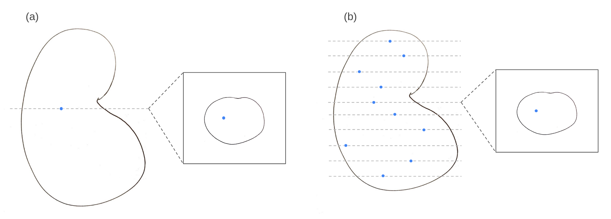
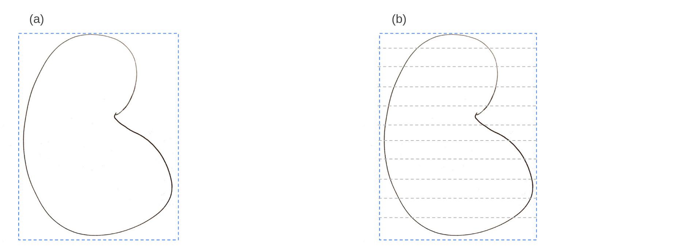
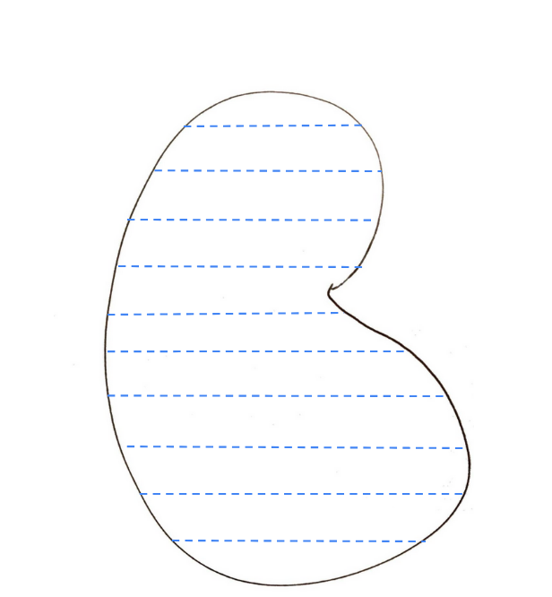
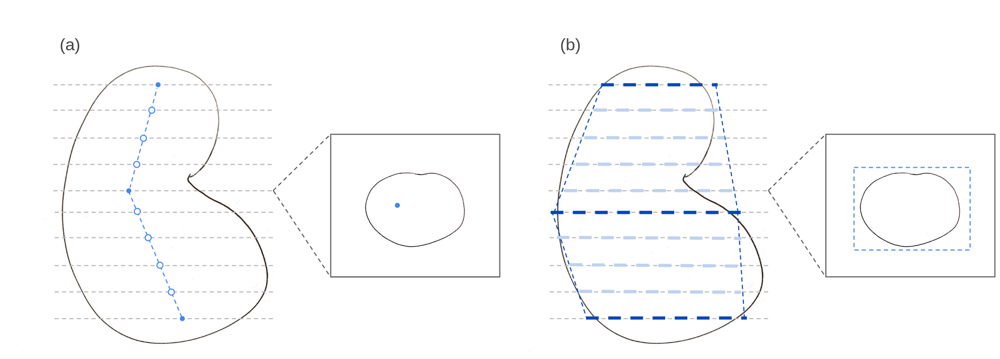
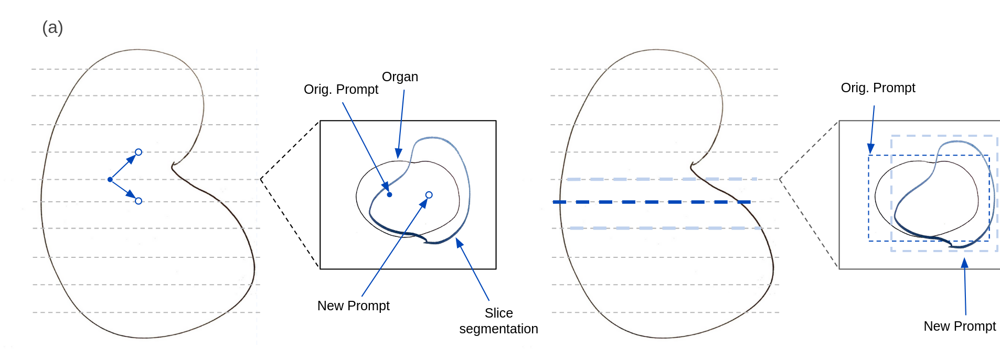

# Status of Project 04/06
## Implementation progress

| Model             | Point prompts | Box Prompts | Interactivity |
|-------------------|---------------|-------------|---------------|
| SAM               |&#10003;             |&#10003;           | x             |
| MedSAM            |&#10003;             |&#10003;           | x             |
| SAM-Med2D         |&#10003;             |&#10003;           | x             |
| SAM-Med3D         |&#10003;             |&#10003;           | x             |
| (SAM-Med3D-Turbo) |&#10003;             |&#10003;           | x             |
| SegVol            | x             | x           | x             |

Ticks = model implemented and verified to perform identically (except for SAM-Med3D) to the original

Other changes:
- Move image and gt loading into the predictor class to allow for differences between models (eg some models require RAS, others do not). This means the ground-truth also needs to be loaded in through the predictor class to ensure it's in the correct orientation.
- SAM-Med3D sliding window isn't working (a github issue has been raised), if they get back to me, perhaps I should include that method? (it performed worse in the cases where it worked - to dicuss)
- 

## Planned experiments
Let $n_{fg}$ be the number of axial foreground slices contained within a volume to be segmented.

### Category 1: No interactions
#### n=1, n=5 points per volume/foreground slice

Inputs:
* 3D: n points sampled uniformly at random from the foreground - one forward pass, n=1, n=5
* 2D: n points sampled uniformly at random from the foreground for each slice containing foreground, so $n_{fg}$ forward passes. n=1, n=5

#### Bbox per volume

Inputs:
* 3D: One minimal bounding box (increased by a small margin to match training?) for the volume - one forward pass
* 2D: Create the same minimal bounding box, and take axial slices of it for the corresponding axial slice of the image - $n_{fg}$ forward passes

#### 2D BBox: minimal bounding box per fg slice

Inputs:
* 2D: For each slice with foreground, supply a minimal bounding box for that slice - $n_{fg}$ forward passes

#### Line propagation

Inputs:
* 2D: n=3 points (to be increased if you think targets are too complex for this. Could also check experimentally for when this levels out in performance), one in each of the lowest, middle, and highest axial slice containing foreground. Interpolate a line between these points and use the intersections of the liens with the axial slices as prompts. A line interpolation and then $n_{fg}$ forward passes.

#### Mask propagation

Inputs:
* 2D: $n=5$ seed points in the middle slice as well as the index of the lowest and highest slice containing foreground. Perform a forward pass, sample $n=5$ points from the generated segmentation, pass them as prompts for the next slice down, repeat until reaching the supplied index. Do the same moving upwards from the middle to the highest slice. n to be negotiated.

#### MedLSAM Propagation

Inputs:
* 2D: $n=5$ seed points in the middle slice. Point propagation should be entirely handled by MedLSAM

### Category 2: Fixed DoF budget
* 3D:
  *  Supply one point, generate segmentation, sample from the misclassified points, supply the next positive/negative point, repeat until DoF budget is exhausted.
  *  Boxes - supply an initial box and then proceed as above with poitns to correct the segmentation until DoF budget is exhausted
* 2D:
  * Start with either line propagation or mask propagation depending on which works better according to the experiments in category 1. Then correct as follows: 0) Pick slice with most error -> 1) sample from misclassified pixels -> 2) Generate new segmentation with the correction point ->  go to 0) and loop until DoF are exhausted
  * (I don't see good cleverer options and I think the search space increases greatly - lets discuss)

### Category 3: Fixed Performance
Perform the same experiments as in category 2, but looping until a performance (eg 50,70,90 DSC) is reached. Handle infinite loops and say that the performance wasn't reached.

## Datasets to use 
(see spreadsheet)
| Dataset                | Modality                 | Targets                       |
|------------------------|--------------------------|-------------------------------|
| Adrenal-ACC-Ki67       | CT                       | Adrenocortical carcinoma      |
| ATLAS2023              | CE-MRI                   | Liver, tumors                 |
| CAS2023                | TOF-MRA                  | Cerebral arteries             |
| CC-Tumor Heterogeneity | MR                       | Cervical Cancer               |
| HCC-TACE-Seg           | CT                       | Liver Cancer                  |
| LNQ2023                | CT                       | Mediastinal lymph node        |
| SegRap                 | CT                       | Nasopharyngeal organs, tumors |
| TDSC-ABUS2023          | Ultrasound               | Breast tumors                 |
| ToothFairy2023         | CBCT                     | Inferior Alveolar Nerve       |
| ULS                    | CT                       | Thoracic-abdominal lesions    |
| Yale Brain Metastases  | MRI - T1, CT1, T2, Flair | Brain metastases              | 

### Proposal:

Eliminate:
ULS: cropped ROIs, center pixel always foreground - ask Consti, Max Rokuss
Yale Brain Metastases: difficult to summarize

| Dataset                | Modality                 | Targets                       |
|------------------------|--------------------------|-------------------------------|
| ATLAS2023              | CE-MRI                   | Liver, tumors                 |
| CAS2023                | TOF-MRA                  | Cerebral arteries             |
| CC-Tumor Heterogeneity | MR                       | Cervical Cancer               |
| HCC-TACE-Seg           | CT                       | Liver Cancer                  |
| SegRap                 | CT                       | Nasopharyngeal organs, tumors |
| ToothFairy2023         | CBCT                     | Inferior Alveolar Nerve       |

## Timeline
Implementation steps:
* SegVol (1.5 week - 17/6)
* Interactivity (2 weeks - 1/7)
* Experiments (2 weeks - 15/7)
    * Line propagation for boxes
    * Mask propagation for points and boxes
    * Interactive points (category 2, 3) 
    * Interactive boxes (category 2, 3)
* ?
* Paper writing? (? weeks)
## new timeline 24.06
*interactivity as discussed 2d models ( 5.7)
*interactivity sammed3d + turbo (12.7)
*SegVol both + one week
*Vista (maybe) 